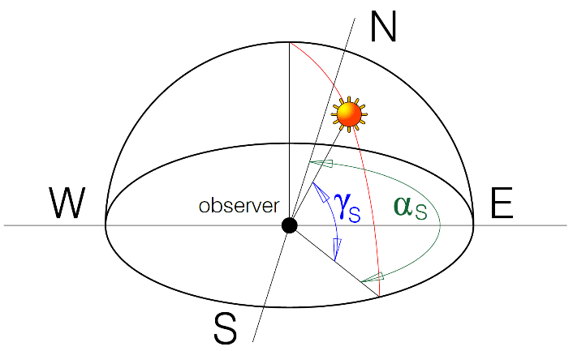

# Solar Plant Shadow Analysis



## Overview

This project aims to analyze the impact of shadows from surrounding tall trees on the energy production of a solar plant. By leveraging Python, it calculates the solar position at any given datetime from any point on Earth, computes the cast shadow, and exports the results to an AutoCAD-compatible format. Additionally, it provides analytical insights and generates animations to aid in understanding the behavior of cast shadows over time.

## Features

- **Solar Position Calculation**: Utilizes astronomical algorithms to accurately determine the position of the sun relative to the observer's location and time.
- **Shadow Calculation**: Computes the shadow cast by surrounding tall trees on the solar panels, considering the varying solar position throughout the day and year.
- **Export to AutoCAD**: Outputs the shadow analysis results in an AutoCAD-compatible format for further visualization and integration into design plans.
- **Analytics**: Performs statistical analysis to gain insights into the extent of shadow impact on energy production.
- **Animation**: Generates visual animations depicting the changing shadow patterns over time, facilitating a better understanding of shadow behavior.

## Installation

1. Clone the repository:

   ```bash
   git clone https://github.com/your-username/solar-plant-shadow-analysis.git
   ```

2. Install the required dependencies (not implemented yet):

   ```bash
   pip install -r requirements.txt
   ```

## Usage

1. Run the main script `shadow-casting.ipynb`:

2. Follow the prompts to input the necessary parameters such as location, datetime, and tree height.

3. Once the analysis is complete, review the exported AutoCAD files and generated animations for insights into shadow impact.

## Example

To demonstrate the usage of the project, consider the following scenario:

- **Location**: Solar plant situated in California, USA.
- **Datetime**: June 21st, 2024, 12:00 PM.
- **Tree Height**: 20 meters.

Running the analysis with these parameters provides detailed information on the shadow cast by the surrounding trees at that specific time, aiding in decision-making for optimizing solar panel placement and maximizing energy production. You can play with some of the animations developed by clicking on the links below:
- [Azimuth vs Elevation](https://htmlpreview.github.io/?https://github.com/pedrodamas1/Shadow-Casting/blob/main/html/azimuth%20vs%20elevation.html)
- [Shadow Length vs Day](https://htmlpreview.github.io/?https://github.com/pedrodamas1/Shadow-Casting/blob/main/html/shadow%20vs%20day.html)
- [Shadow Length vs Hour](https://htmlpreview.github.io/?https://github.com/pedrodamas1/Shadow-Casting/blob/main/html/shadow%20vs%20hour.html)

## Contributors

- All welcome!

## License

This project is licensed under the MIT License. See the [LICENSE](LICENSE) file for details.

## Acknowledgements

Special thanks to the developers of the [pvlib-python](https://github.com/pvlib/pvlib-python) library for providing essential tools for solar energy analysis.

Feel free to customize it further to suit your project's specific details and requirements!
